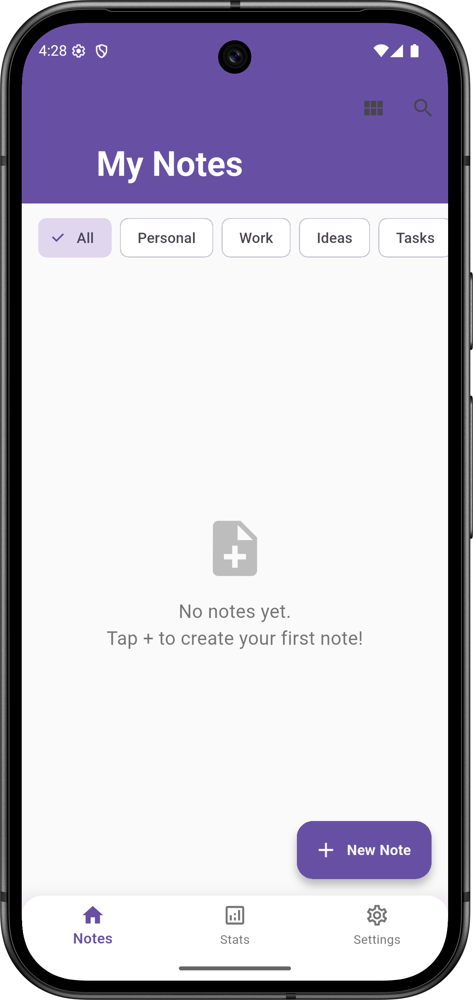
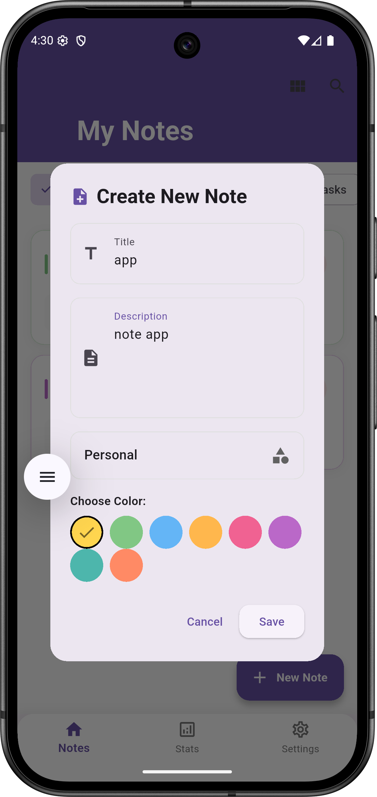
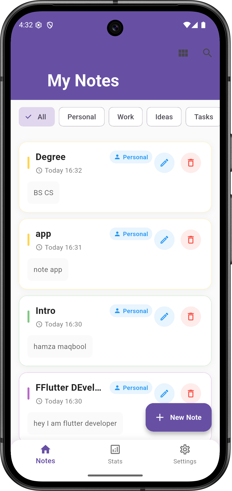
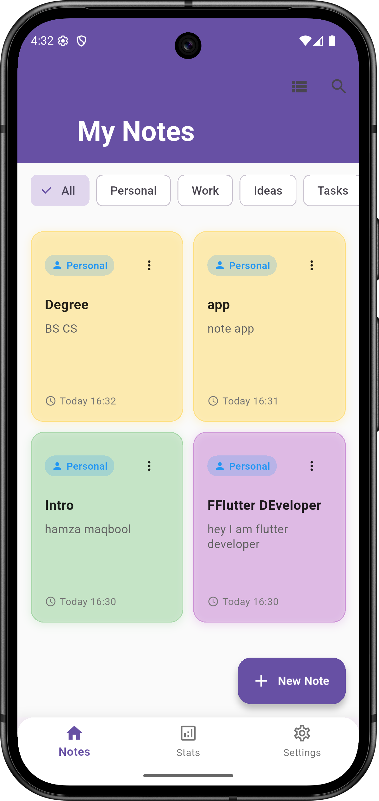
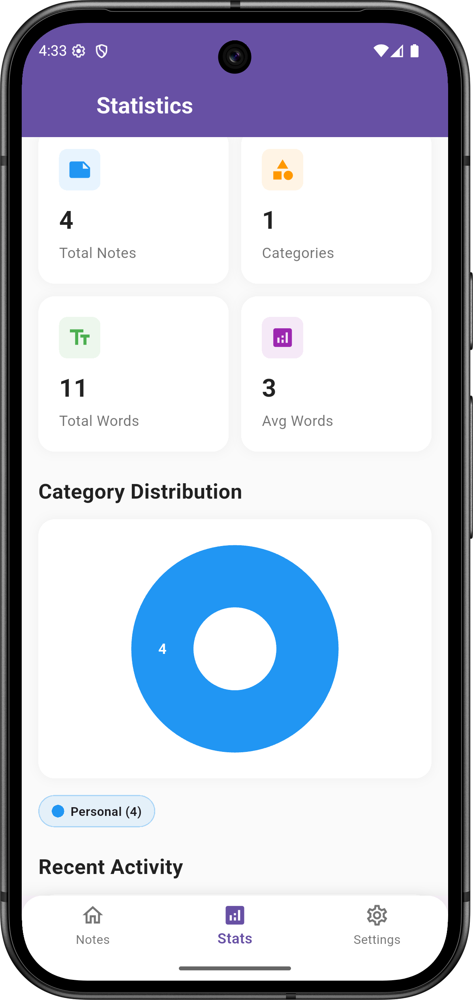
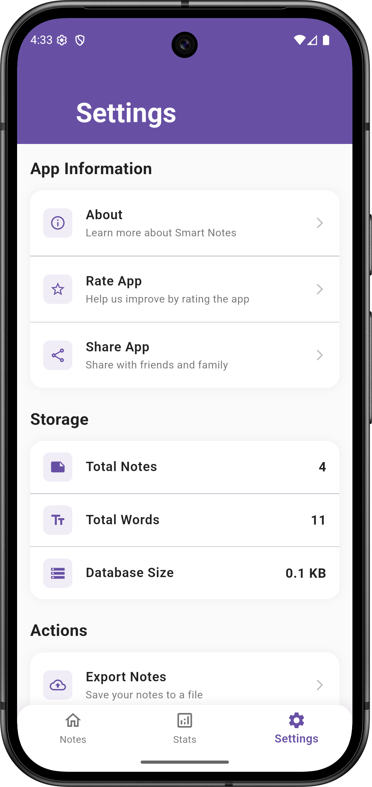

# 📝 Smart Notes

<div align="center">


**A beautiful, feature-rich note-taking app built with Flutter & Hive**

[Features](#-features) • [Installation](#-installation) • [Usage](#-usage) • [Screenshots](#-screenshots) • [Contributing](#-contributing)

</div>

---

## 🌟 Features

### 📱 **Core Functionality**
- ✅ **Create & Edit Notes** - Rich text editing with titles and descriptions
- ✅ **Smart Organization** - Categorize notes (Personal, Work, Ideas, Tasks, Other)
- ✅ **Color Coding** - 8 beautiful color themes for visual organization
- ✅ **Real-time Search** - Instantly find notes by title or content
- ✅ **Category Filtering** - Quick filter by note categories
- ✅ **Dual View Modes** - Switch between grid and list layouts

### 🎨 **Beautiful UI/UX**
- ✨ **Material 3 Design** - Modern, clean interface following Google's latest design system
- 🌈 **Gradient Themes** - Beautiful color gradients and glassmorphism effects
- 🎭 **Smooth Animations** - Fluid transitions and micro-interactions
- 📱 **Responsive Design** - Optimized for all screen sizes
- 🔍 **Interactive Search** - Dynamic search with instant results

### 📊 **Analytics Dashboard**
- 📈 **Visual Statistics** - Beautiful pie charts showing note distribution
- 📋 **Quick Metrics** - Total notes, categories, word count at a glance
- 🕒 **Activity Tracking** - Recent notes and usage patterns
- 📅 **Time-based Stats** - Daily, weekly activity insights

### ⚙️ **Advanced Features**
- 💾 **Local Storage** - Lightning-fast Hive database for offline functionality
- 🗂️ **Export/Import** - Backup and restore your notes (coming soon)
- ⚡ **Performance Optimized** - Smooth scrolling with thousands of notes
- 🎯 **Smart Sorting** - Notes sorted by last updated date

---

## 📸 Screenshots

<div align="center">

### Main Screens




<br/><br/>

### Analytics & Stats




<br/><br/>

### Settings & Other Screens



</div>

*Beautiful, modern interface with Material 3 design*

---

## 🚀 Installation

### Prerequisites
- Flutter SDK (>=3.0.0)
- Dart SDK (>=3.0.0)
- Android Studio / VS Code
- Git

### Quick Setup
1. **Clone the repository**
```bash
git clone https://github.com/yourusername/smart-notes.git
cd smart-notes
